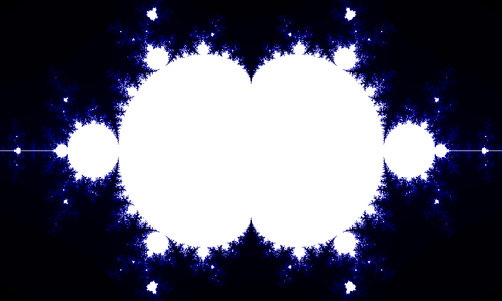

# FractalImageGenerator
This program generates fractal images using parallel programming(multiple threads). 
It generates a matrix of complex numbers each of which corresponds to a pixel that would be on the output image.
Then we start threads on non crossing submatrices(most of them are square submatrices) to speed up the computation.
The size of these submatrices depend on granularity 
How to build and use:
```
mvn clean package
cd target/
java -jar SPO-0.0.1-SNAPSHOT-jar-with-dependencies.jar -size 1920x1080 -rect -8.0:8.0:-4.5:4.5 -tasks 4 -output fractal.png -granularity 50
```
## Options
* -size widthxheight
  * Defines the size of the fractal image
* -rect beginingOfRealAxis:EndOfRealAxis:BeginOfImaginaryAxis:EndOfImaginaryAxis
  * Defines the rectangle on the complex plane which will be visualized
* -tasks threadCount
  * Defines the number of threads that will run in parallel during computation
* -output fractal.png
  * Defines the name of the output image of the fractal
* -granularity pixelCount
  * Threads submatrice size 

